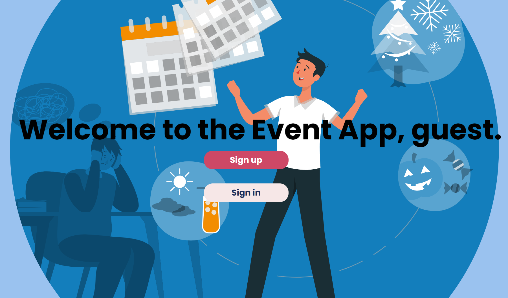

# Event Planner

## Description
Event Planner is a web application designed to help users create, manage, and track events. Users can sign up and log in to manage their event lists, add new events, edit existing ones, or delete events no longer needed. Events are categorized by status (e.g., In progress, Completed, Cancelled) for easy tracking.

I built this app to provide a simple, intuitive tool for personal event management, allowing users to keep their schedules organized and ensure nothing gets overlooked.

## Getting Started
### Use the App

You can use the deployed Event Planner app here: [Event Planner Live](https://event-planner-app-a227bf7a787a.herokuapp.com/)

### Instructions
1. **Sign up or Log in** to start managing your events.
2. **Add New Events** by filling in details such as title, date, description, and status.
3. **View Your Events** on the dashboard, organized by status.
4. **Edit or Delete Events** as needed to keep your schedule up-to-date.

### Planning Materials
- [Trello Board](https://trello.com/invite/b/66e4d01f5388cc5b0d8f5542/ATTI234eef0dab69308f93ba65aee0ac5a8d12CA018F/event-planner)  
- [Wireframes](https://www.figma.com/board/TnhBvURSE9yyqkOFxA1MPZ/Event-index-page?node-id=0-1&t=WMhnGZzYyrxXtJUa-1)  

## Attributions
This project uses the following external resources:
- **Mongoose Schemas**: For `userSchema` and `eventSchema` to handle user authentication and event management.
  
## Technologies Used
- **JavaScript**: Main logic and interaction on both client and server-side.
- **Node.js** and **Express.js**: Backend framework for routing and server-side logic.
- **MongoDB** with **Mongoose**: For storing user data and events.
- **EJS (Embedded JavaScript)**: For rendering dynamic views.
- **CSS Flexbox**: For responsive page layout and styling.

## Next Steps
Here are some future enhancements I plan to implement:
- **Calendar View**: Provide a calendar interface for a monthly overview of events.
- **Event Reminders**: Allow users to set reminders for upcoming events via email.
- **Event Categories**: Enable custom tagging and filtering of events based on categories.
- **Invite Friends**: Let users invite others to events and share event details via email.
